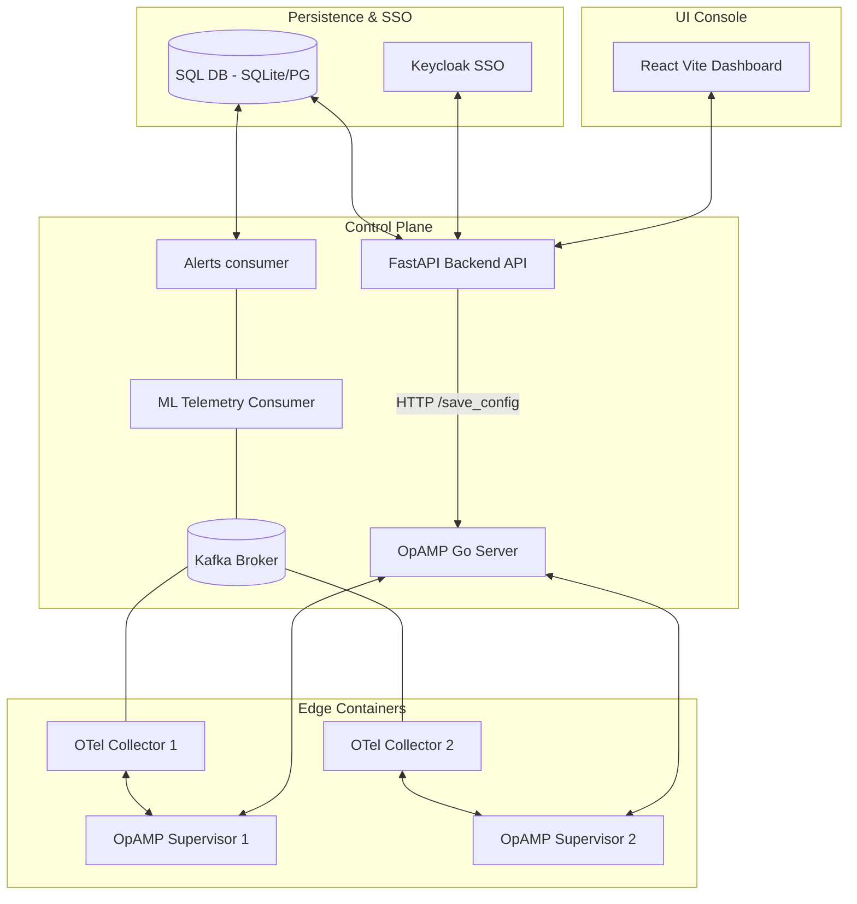

# FleetPilot 

A stateless **OpAMP Control Plane & Telemetry Fleet Management System** integrated with **Diurnal Machine Learning Anomaly Detection** and **Audit-Log Root Cause Analysis (RCA)**.

`FleetPilot` enables infrastructure and DevOps teams to remotely govern fleets of OpenTelemetry collectors using the OpAMP protocol, distribute configurations, and automatically diagnose system metric departures against historical baselines.

---

## Key Features

* **Control Plane (OpAMP Protocol):** Bidirectional management of OpenTelemetry collector configurations ([collector-supervised.yaml](file:///c:/Users/HARSH/Desktop/opamp/fleet_agents/agent-2/collector-supervised.yaml)), config versioning, and deployment rollouts using [opamp-go](file:///c:/Users/HARSH/Desktop/opamp/opamp-go).
* **Heterogeneous Multi-Agent AI Orchestration:** Powered by LangGraph and Groq, specialized AI agents (`llama-3.3-70b-versatile`, `qwen3-32b`, `llama-4-scout-17b`) autonomously parse natural language requests, generate OTel YAML configurations, create fleets, assign agents, and orchestrate safe rollouts with Human-in-the-Loop approval.
* **Diurnal ML Anomaly Engine:** Utilizes an unsupervised `IsolationForest` model to establish a weekly diurnal baseline (CPU, memory, disk, network throughput, and processes count) and automatically classify anomalies.
* **Stateless Scaling (K8s Ready):** Built for Horizontal Pod Autoscaling (HPA) featuring:
  * Centralized SQL Database compatibility (SQLite fallback to PostgreSQL).
  * Stateless HS256 JWT authorization for local credentials and Docker IDP SSO bypass.
  * Load-balanced telemetry parsing utilizing Kafka Consumer Groups.
* **Incident Audit Correlation:** Automatically correlates detected telemetry metric anomalies with preceding configuration changes, rollback actions, or agent restarts inside a $[-10\text{min}, +2\text{min}]$ window to identify human root causes instantly.
* **Modern Telemetry Dashboard:** Glassmorphic dashboard built in React + Vite, exposing an AI chat interface, agent status tables, real-time telemetry graphs, a YAML editor preview sandbox, and warning alert banners.

---

## Architecture Overview



---

## 🛠️ Tech Stack

* **Frontend:** React, Vite, Vanilla CSS (Glassmorphism), Lucide React
* **Backend:** FastAPI, Python, SQLAlchemy, PyJWT
* **AI & Orchestration:** LangGraph, Groq API (Llama 3.3, Qwen)
* **Message Broker:** Apache Kafka (9092/9094)
* **Datastore:** SQLite (Local development) / PostgreSQL (Cluster production)
* **Agent Protocol:** OpAMP WebSocket (Go server)
* **Observability:** Prometheus, Alertmanager, Grafana

---

## Project Structure

* [app/](file:///c:/Users/HARSH/Desktop/opamp/app/): Main Python FastAPI application codebase.
  * [models/](file:///c:/Users/HARSH/Desktop/opamp/app/models/): SQLAlchemy database schemas (e.g. `Anomaly`, `User`, `Agent`, `AuditLog`).
  * [routes/](file:///c:/Users/HARSH/Desktop/opamp/app/routes/): FastAPI endpoints handling authentication, agent registration, configurations, and metrics correlation.
  * [ml/](file:///c:/Users/HARSH/Desktop/opamp/app/ml/): Telemetry parsing stream parser ([consumer.py](file:///c:/Users/HARSH/Desktop/opamp/app/ml/consumer.py)) and anomaly detector ([detector.py](file:///c:/Users/HARSH/Desktop/opamp/app/ml/detector.py)).
* [frontend/](file:///c:/Users/HARSH/Desktop/opamp/frontend/): React Vite dashboard source code.
* [fleet_agents/](file:///c:/Users/HARSH/Desktop/opamp/fleet_agents/): Mounting volumes for active collectors and agent supervisors.
* [opamp-go/](file:///c:/Users/HARSH/Desktop/opamp/opamp-go/): Fork/Example Go implementation of the OpAMP server.

---

## Quick Start

### 1. Prereqs & Infrastructure
Bring up the Kafka, Keycloak, Prometheus, and supervisor containers:
```bash
docker compose up -d
```
Verify that all 12 services are active and running.

### 2. Start the Backend API
Install dependencies and run the Uvicorn application server:
```bash
pip install -r requirements.txt
python run.py
```
*The database creates itself and seeds mock tables automatically on startup.*

### 3. Start the Frontend Dev Server
Navigate to the frontend folder and start Vite:
```bash
cd frontend
npm install
npm run dev
```
Open [http://localhost:5173/](http://localhost:5173/) in your browser.

---

## Stateless Authentication Options

1. **Keycloak SSO:** If configuration endpoints are resolved, sign in using default Keycloak authentication mapping.
2. **Local Credentials:** Admin access using `admin` / `admin123`.

---

## Simulating Anomalies and Correlation

To test the anomaly detection and dynamic correlation triggers:
1. Deploys or rollbacks configuration changes to write a record in the `audit_logs` database table.
2. Trigger load spikes using the **Simulator Dashboard** panel or make a direct API call to simulation endpoints.
3. Once metrics depart from baseline averages, the `ml-alerts` Kafka topic publishes the anomaly, generating a card in the dashboard flagged with the warning correlation banner:
   * *“⚠️ Correlated: DEPLOY_CONFIG (collector-supervised) detected 3.5m prior by admin”*
